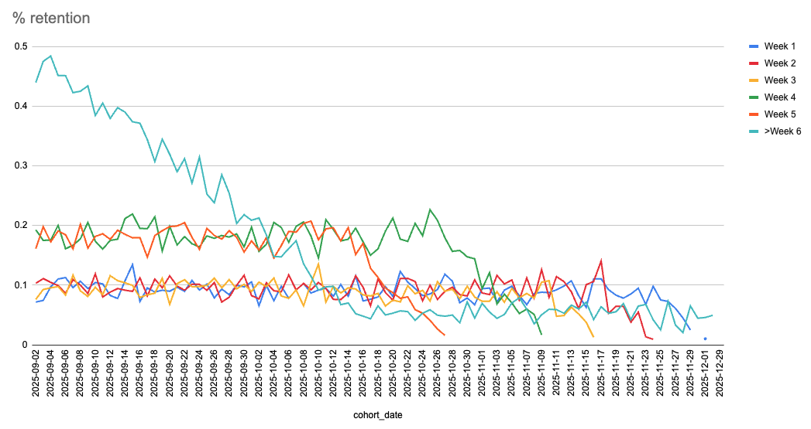
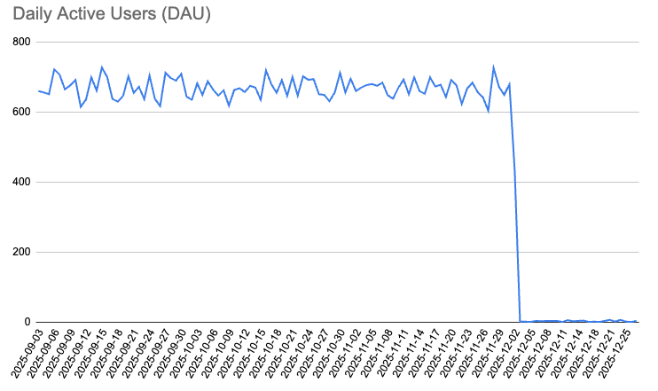
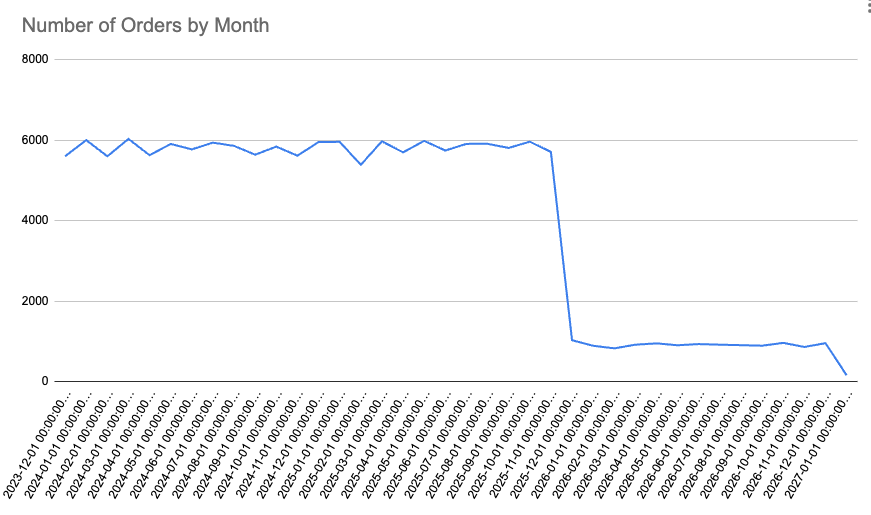
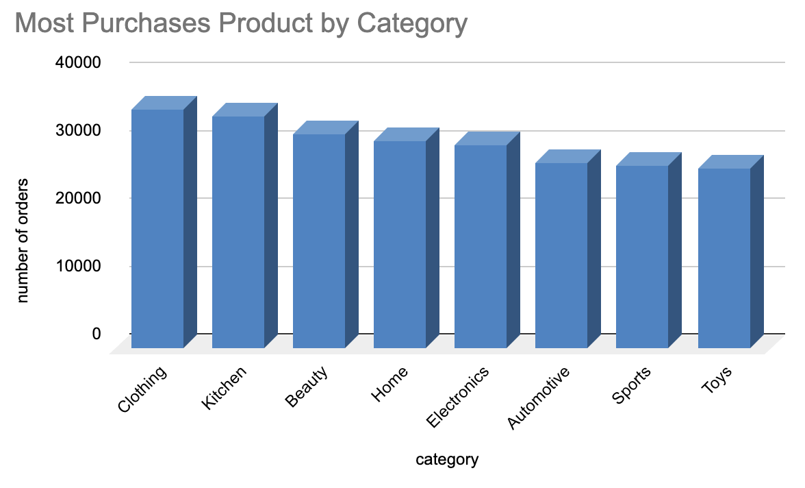

# Analysis Insights

## Cohort Retention
The retention analysis include cohort generation based on first activity date, weekly activity aggregation and cohort-size normalization.

- Stable Short-Term Retention
    - Weeks 1–3 retention remained relatively stable across most cohorts, averaging approximately 7%–12%.
    - initial engagement flows are effective
- Strong Decline in Long-Term Retention
    - The most significant trend appears in the Week 6+ retention metric. 
    - Newer cohorts have had less time to accumulate long-term activity, which can naturally lower Week 6+ retention metrics.
- Earlier Cohorts Performed Better 
    - Earlier cohorts outperformed newer cohorts in both medium-term and long-term retention metrics (Possiblly more effective campaigns or seasonal effects)

### Business Implications
- The platform succeeds in generating initial engagement
- Users continue returning during the early lifecycle stages
- Long-term retention remains a major challenge

For future improvement:
- lifecycle marketing campaigns
- personalized experiences
- re-engagement strategies
- content freshness and user incentives

## Converstion 
99.7% of the users purchade at least once, 
99.7% of the users that add an item to chart end up purchase it 
--99.1% of the users that searched for an item add it to chart 
- refund rate is 7.5% refund out of success

## DAU/MAU
- DAU remained relatively stable, averaging approximately 600–700 active users per day (around 09/2025-12/2025)
- MAU peaked at approximately 16K users in September 2025, before experiencing a significant decline to around 1K users by December 2025, 
followed by a further decrease to approximately 100 monthly active users in later periods.

## Orders Analysis
- The average monthly order amount remained relatively stable at approximately $45K.
- Starting in December 2025 (specifically on the 03/12/25), the number of monthly orders declined significantly, decreasing from approximately 6K orders per month to nearly 1K orders.
- This decline strongly correlates with the reduction in total revenue, which dropped from approximately $250M to around $50M over the same period

## Products Analysis 

- Top purchased categories are Clothing, Kitchen and Beauty

## Customers Analysis 
- Most of the orders that made are from Korea and Congo, as well most of the paying customers. 

